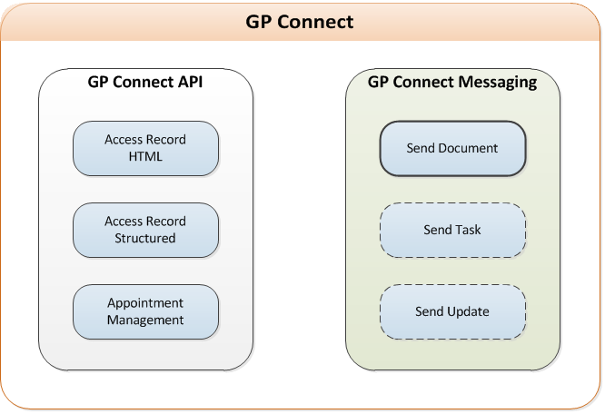




{:target="_blank" class="no_icon"} {:target="_blank" class="no_icon"} 


GP Connect aims to support better clinical care by opening up information and data held within GP Principal Clinical Systems for use across health and social care. The GP Connect vision will be achieved by standardising integration and simplifying the operating model. Find out more on the [NHS Digital GP Connect homepage](https://digital.nhs.uk/article/1275/GP-Connect).

GP Connect has initially focused on delivering HTTP FHIR&reg; APIs. The current GP Connect FHIR API specification is found at [https://nhsconnect.github.io/gpconnect/](https://nhsconnect.github.io/gpconnect/). An additional set of capabilities, under the badge GP Connect Messaging, are described in this specification. These new capabilities are focused on enabling updates to GP practice systems. 

The resulting full set of capabilities delivered through GP Connect is illustrated below:

 

## Using Messaging to perform updates ##

In contrast to the synchronous FHIR&reg; API approach which has been taken to enable read-only access to patient information, updates to patient data will be fulfilled through a *messaging* approach.

Update messages will:

- be sent using [MESH](https://digital.nhs.uk/services/message-exchange-for-social-care-and-health-mesh "MESH")
- use the [HL7 FHIR&reg; STU3](http://hl7.org/fhir/stu3/index.html) interoperability standard to define their structure
- include FHIR&reg; messaging information as defined by the [ITK3 message distribution, v2.5.0](https://developer.nhs.uk/apis/itk3messagedistribution-2-5-0/) standard

## Who will be interested in these capabilities? ##

Two main audiences will be interested in this specification:

1. Message senders: NHS organisations seeking to send messages
2. Message receivers: GP practices seeking to receive and process messages

This specification is primarily aimed at message senders. Where information is aimed at message receivers only, this is made clear.





